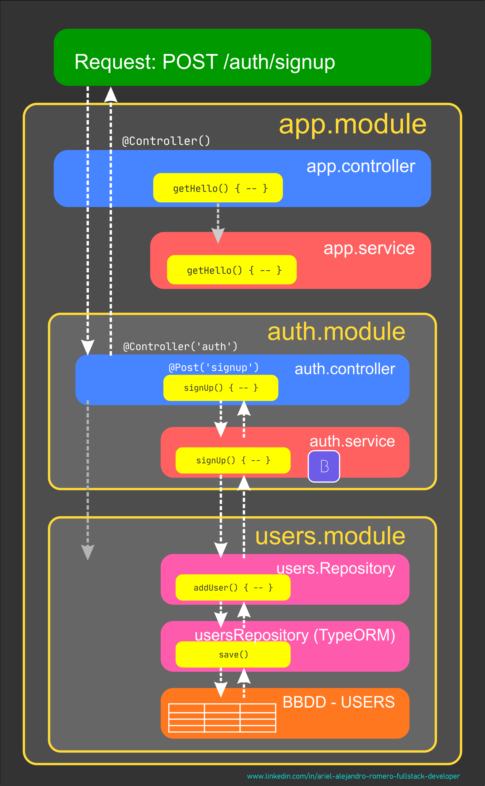
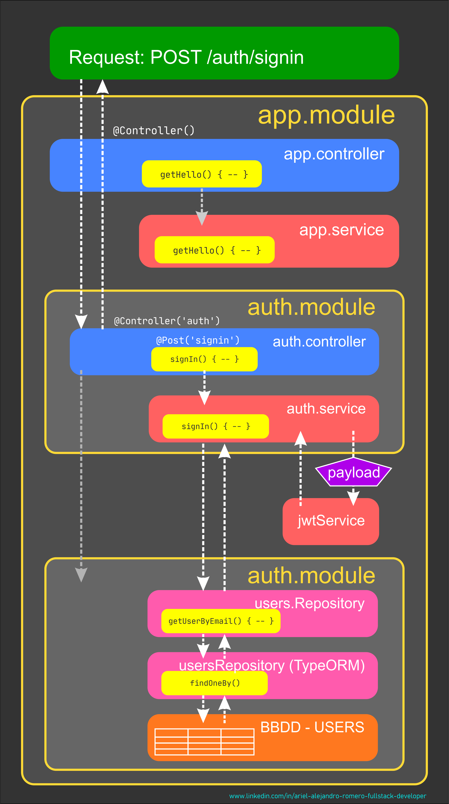

# Nest JS - Nest JS Authentication I

[Volver a Inicio](../README.md)

## Links

- [bcript - Documentación](https://bcrypt.online/)
- [JWT - JSON Web Token - Documentación](https://jwt.io/)

## Bcrypt

### Comando de Instalación

```bash
npm install bcrypt
```

## JWT - JSON Web Token

### Comando de Instalación

```bash
npm install --save @nestjs/jwt
```
## Bcrypt - Registro y Encriptado de Contraseña



## JWT y Autenticación

